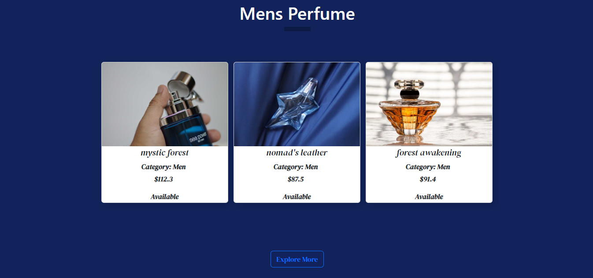
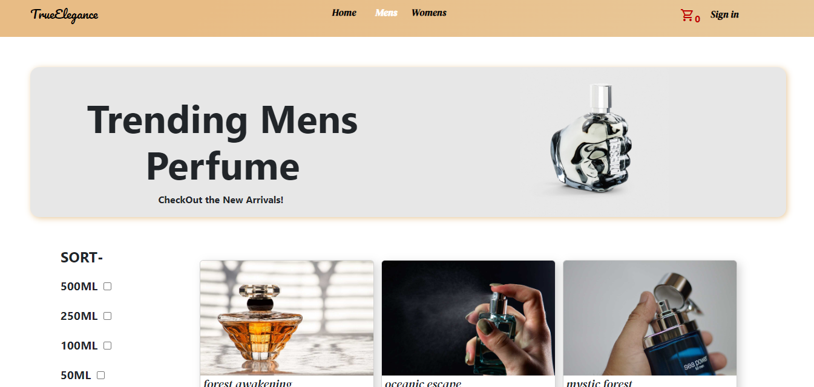
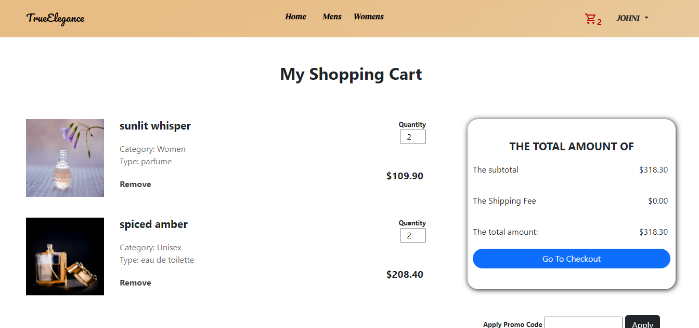

# TrueElegance: The Perfume Store
TrueElegance is a fully responsive e-commerce project that sells Perfumes. Features include **user authentication (register, login), add to cart and APIs authorizations.**

## Home Page

## Category Page
On the men/women page, you can place multiple filters with the sidebar on the left. React state was extremely useful to filter each product and display it on the page.

## Cart Page
on the cart page, you can view all the products that you have added and you must log in first before visiting the cart page. On the cart page, you can change the product quantities or remove the product

#### Technologies Used - Javascript, React.js, react-router-dom(v6), Node.js/Express, MongoDB/Mongoose, express-session, bootstrap

##### Visit The Link -
https://e-commerce-frontend-hmet.onrender.com

Use this email and password for testing -\
**Email**: test@gmail.com\
**Password**: test123

feel free to create a new account and test the user 
authentication.